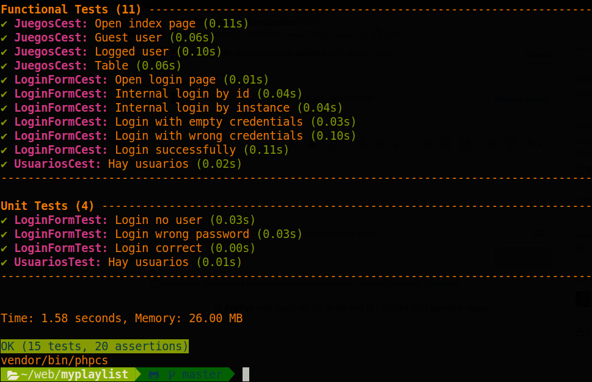
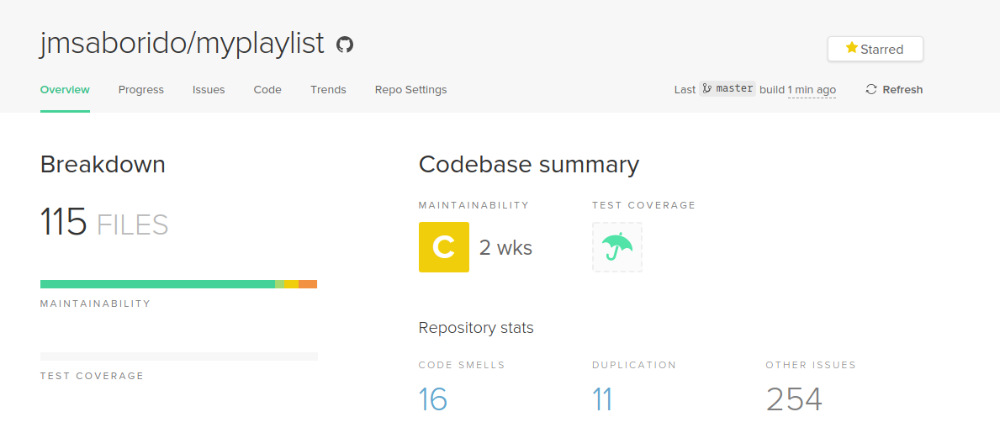
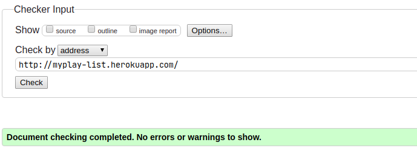
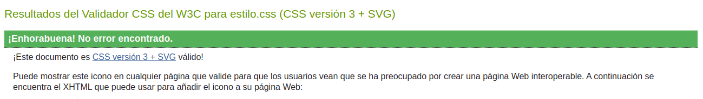
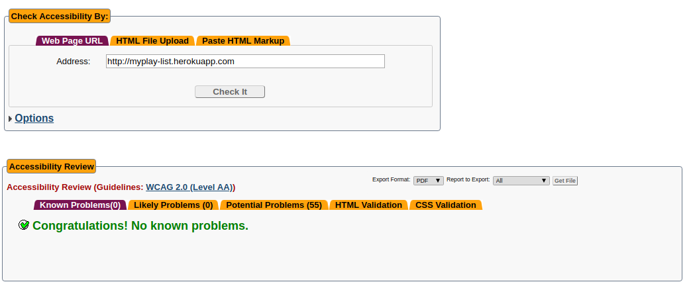
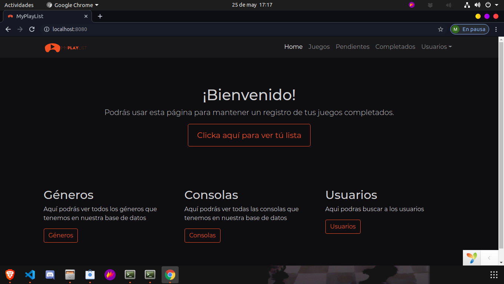
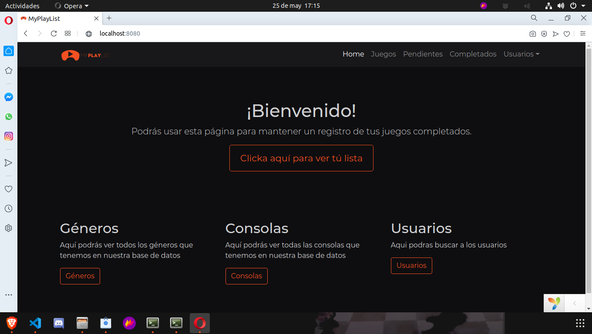

# Anexos


### *([R25](https://github.com/jmsaborido/myplaylist/issues/25)) Codeception*



---

### *([R26](https://github.com/jmsaborido/myplaylist/issues/26)) Code Climate*



Los problemas que da son de codigos que pasan de 25 lineas, de codigos de los plugin o codigos que se repiten(los controladores declaran el namespace de controller)

---


### *([R34](https://github.com/jmsaborido/myplaylist/issues/34)) Validación HTML5, CSS3 y accesibilidad*
### Validación de HTML y CSS

*HTML*



[Enlace a la validación HTML](https://validator.w3.org/nu/?doc=http%3A%2F%2Fmyplay-list.herokuapp.com%2F)

*CSS*



[Enlace a la validación CSS](https://jigsaw.w3.org/css-validator/validator?uri=myplay-list.herokuapp.com&profile=css3svg&usermedium=all&warning=1&vextwarning=&lang=es)

En la imagen sale sin errores, pero si pulsas el enlace, te lleva a la validación de la página, y falla por culpa de Bootstrap y de JQuery


### Validación de accesibilidad



[Enlace a la validación WCAG](https://achecker.ca/checker/)

---

### *Prueba del seis*

 1. ¿Qué sitio es éste?
- La aplicación tiene en todo momento elementos indicativos de que sitio es. Arriba en la menú de navegación está en todo momento el logotipo de la aplicación.El menú de navegación y el pié de página se mantienen siempre, por lo que siempre está identificado el sitio.

 2. ¿En qué página estoy?
- Todas las páginas del sitio están identificadas por las migas de pan (excepto la inicial), lo que te sitúan en todo momento.

 3. ¿Cuales son las principales secciones del sitio?
- Las principales secciones del sitio son *Completados*, *Juegos*, *Pendientes*, *Generos* y *Consolas* (solo serán visibles si estamos logueados en la aplicación).

 4. ¿Qué opciones tengo en este nivel?
- Dependiendo de si eres administrador o un usuario, podras crear, eliminar, modificar y ver los modelos. Pero depende de cada uno, por ejemplo los géneros no se pueden borrar, pero las consolas si

 5. ¿Dónde estoy en el esquema de las cosas?
- En todas las páginas existe en la zona superior un indicador de bloque con las migas de pan.

 6. ¿Cómo busco algo?
- Cada seccion tiene su buscador especifico.

---

### *([R36](https://github.com/jmsaborido/myplaylist/issues/36)) Varios navegadores*

#### *Google Chrome*



---

#### *Mozilla Firefox*


---

#### *Opera*



---

#### *Microsoft Edge*


---

### *([R38](https://github.com/jmsaborido/myplaylist/issues/38)) Despliegue en local*

Debido a que no me funciona las maquinas virtuales en mi ordeandor voy a documentar como haria paso a paso el despliegue en servidor local.

1. Crear un servicio de nombres de dominio

* Instalamos Bind 9 con el siguiente comando `sudo apt install bind9`

* Una vez instalado nos movemos al fichero `name.conf.local` localizado en `/etc/bind`
* Dentro del archivo lo modificamos de la siguiente manera:

```

     zone "myplaylist.com" IN{
        type master:
        file "/etc/bind/db.myplaylist"
    }

```

*  Creamos el archivo db.myplaylist con el fichero original db.local de la siguiente manera `cp /etc/bind/db.local   /etc/bind/db.myplaylist`

* Modificamos el fichero creado y lo dejamos de la siguiente manera:

```
;
; BIND data file for local loopback interface
;
$TTL    604800
@    IN    SOA    myplaylist.com. root.myplaylist.com. (
                  2        ; Serial
             604800        ; Refresh
              86400        ; Retry
            2419200        ; Expire
             604800 )    ; Negative Cache TTL
;
@      IN    NS    myplaylist.com.
@      IN    A    192.168.100.1
ns     IN    A    192.168.100.1
www    IN    A    192.168.100.1

```

1. Gestionar y administrar el servidor apache


   2.1. Instalar el servidor y configurarlo

   * Para instalar apache usariamos el comando `sudo apt install apache2 `
   * Instalariamos el modulo de PHP con este comando `sudo apt-get install libapache2-mod-php`
   * Tambien instalariamos un driver para el pdo de psql en apache `sudo apt-get install php-pgsql`
   * Clonariamos el repositorio en el directorio `/var/www/html/`
   * Hariamos un `make install`, `db/create.sh` y `db/load.sh`
   * Una vez hecho todo esto, reiniciamos apache para confirmar las configuraciones `sudo systemctl restart apache2`

   2.2. Configurar directivas

    * Nos movemos a la ruta `/etc/apache2/sites-available` y modificamos el fichero `000-default.conf`

    * Lo dejariamos de la siguiente manera

```

    <Directory "/var/www/html/myplaylist/web">
                Options +indexes
                AuthType Digest
                AuthName "myplaylist"
                AuthDigestProvider file
                AuthUserFile /etc/claves/digest
                Require user pepe
    </Directory>

```


   2.3. Usar directorios virtuales y redireccionamientos.

    * Copiamos el fichero 000-default.conf de la siguiente manera `cp 000-default.conf  myplaylist.conf` en el directorio `/etc/apache2/sites-available`

    * Una vez copiado detenemos el 000-default con `site a2dissite 000-default.conf`

    * Activamos el sitio de nuestra web con   `site a2ensite myplaylist.conf`

   2.4. Usar diferentes módulos estáticos y dinámicos.

   2.5. Usar autenticaciones.

   * Añadimos el modulo de digest con `sudo a2enmod auth_digest`
   * Creamos el fichero de las claves en `/etc/claves/digest`
    * Añadimos al usuario con el siguiente comando `sudo htdigest -c /etc/claves/ myplaylist pepe`
    * Una vez hecho esto nos pedira una contraseña y confirmarla
    * Para terminar podriamos añadir la directiva `Require user pepe` para que solo pepe pudiera entrar a la aplicacion

   2.6. Usar ficheros de configuración personalizada de directorios.

    * Ya estaria hecho en el punto 2.3.


   2.7. Usar HTTPS y certificados Digitales.

   * Crearemos un par de clave y certificado autofirmados con OpenSSL con este comando
   `sudo openssl req -x509 -nodes -days 365 -newkey rsa:2048 -keyout /etc/ssl/private/apache-selfsigned.key -out /etc/ssl/certs/apache-selfsigned.crt`
    * Con este comando nos iria preguntando la informacion que hay que añadir.

```

    Output
    Country Name (2 letter code) [AU]:ES
    State or Province Name (full name) [Some-State]:Cadiz
    Locality Name (eg, city) []:Sanlucar De Barrameda
    Organization Name (eg, company) [Internet Widgits Pty Ltd]:IES Doñana
    Organizational Unit Name (eg, section) []:
    Common Name (e.g. server FQDN or YOUR name) []:192.168.100.1
    Email Address []: myplaylist.web@gmail.com

```

 * Creamos un nuevo fichero en el directorio `/etc/apache2/conf-available`. Daremos el nombre `ssl-params.conf` al archivo para que quede claro su propósito
 * Le añadimos la siguiente informacion al fichero
    ```
    <IfModule mod_ssl.c>
        <VirtualHost _default_:443>
                ServerAdmin myplaylist.web@gmail.com
                ServerName www.myplaylist.com

                DocumentRoot /var/www/html/myplaylist

                ErrorLog ${APACHE_LOG_DIR}/error.log
                CustomLog ${APACHE_LOG_DIR}/access.log combined

                SSLEngine on

                SSLCertificateFile      /etc/ssl/certs/apache-selfsigned.crt
                SSLCertificateKeyFile /etc/ssl/private/apache-selfsigned.key

                <FilesMatch "\.(cgi|shtml|phtml|php)$">
                                SSLOptions +StdEnvVars
                </FilesMatch>
                <Directory /usr/lib/cgi-bin>
                                SSLOptions +StdEnvVars
                </Directory>

        </VirtualHost>
    </IfModule>
    ```

    * Habilitamos mod_ssl, el módulo SSL de Apache y mod_headers, que necesitan algunas de las configuraciones de nuestro fragmento SSL, con el comando a2enmod:

    ```
    sudo a2enmod ssl
    sudo a2enmod headers
    ```

   *A continuación, habilitamos nuestro host virtual SSL con el comando a2ensite:

    `sudo a2ensite default-ssl`

   * También debemos habilitar nuestro archivo ssl-params.conf, para leer los valores que configuramos:

    `sudo a2enconf ssl-params`

    * Para finalizar, reiniciamos apache y listo.

---

### *(RXX) Tecnologias usadas*

- Ubuntu 20.04 como sistema operativo
- Heroku como alojamiento cloud
- Yii2 como framework
- GIT, GITHUB y GIT-FLOW para el control de versiones
- Visual Studio Code como IDE
- Brave como navegador principal
- Dbeaver como interfaz grafico SQL
- Umlet como editor de diagramas
- Codeception para las pruebas unitarias
- AWS S3 como almacenamiento cloud de archivos
- IGDB como API para obtener datos adicionales de los juegos.

---
