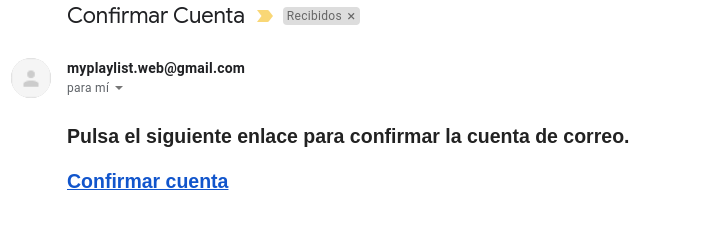
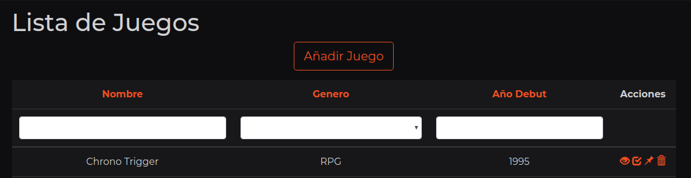
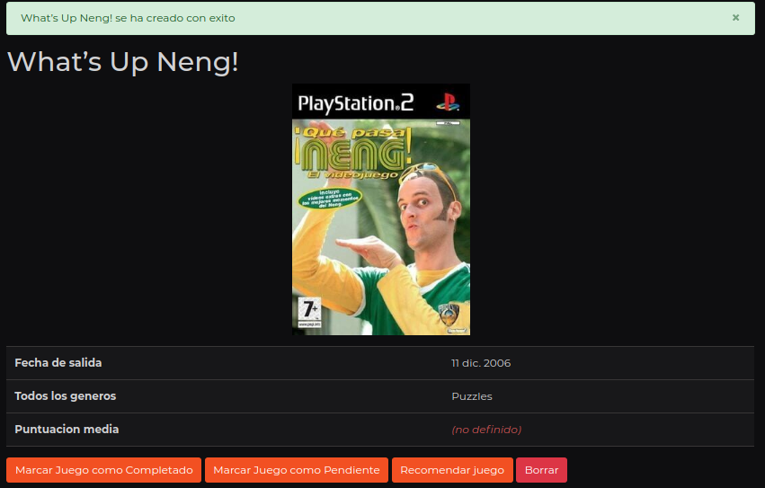
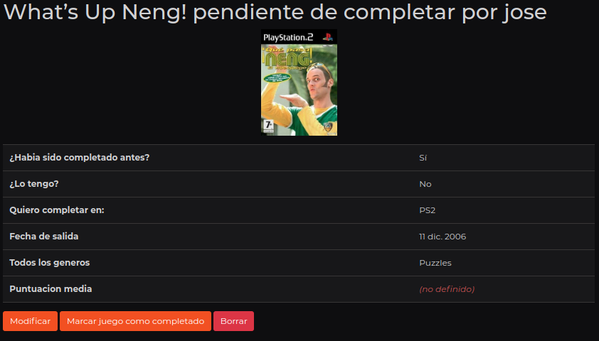
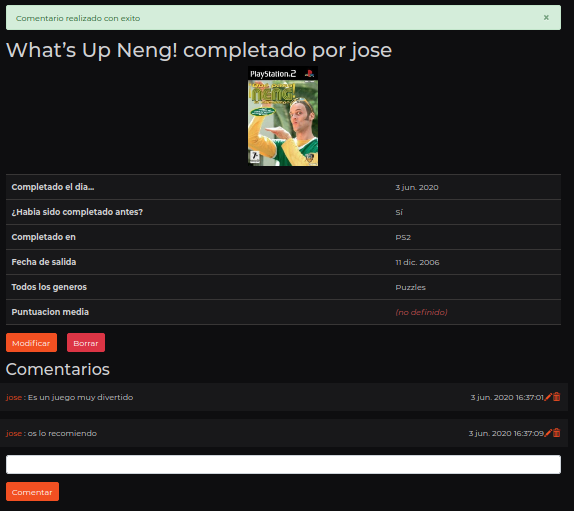
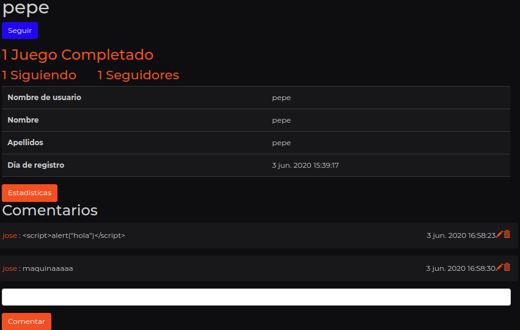
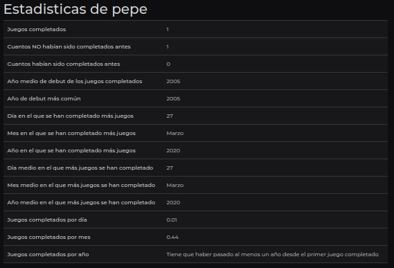
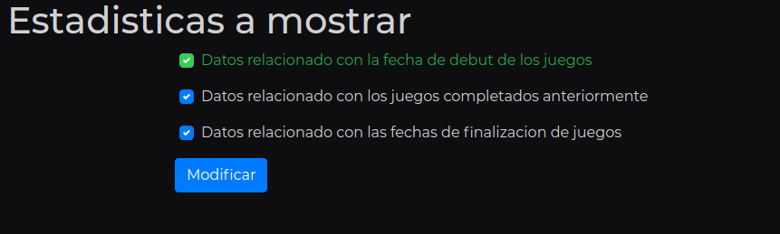

# Manual de usuario

## 1. Registro

De aqui nos iremos a registrar en la página con la opcion registrarse en la pestaña usuarios

Una vez hecho esto, nos llegara un correo electronico con un enlace para confirmar la cuenta

Introduciriamos nuestros credenciales en la página de login y ya estariamos dentro

## 2. Interactuando con los juegos

Una vez logeados, entramos en el apartado de juegos para comenzar con nuestra lista, ya que si entrasemos en los juegos completados nos encontrariamos con esto

En juegos nos encontraremos con la lista de los juegos y estos juegos tendran 4 opciones

De izquierda a derecha harian lo siguiente:
1. Ver el Juego
2. Marcar Juego como completado
3. Marcar Juego como pendiente
4. Borrar Juego (Solo disponible para los ADMIN)

Para este ejemplo, marcaremos un juego como pendiente, ya que tiene un paso adicional.

Pero antes de esto, como el juego que queremos marcar como pendiente no esta en la lista, lo crearemos desde el boton de crear juego

Una vez dentro, escribiremos el juego que queremos añadir a la base de datos y lo seleccionaremos

Cuando este creado el juego nos llevara a una vista completa de el juego.

Asi que ya nada nos impide marcar el juego como pendiente. Clickamos el boton y nos enviara a la creacion del juego como pendiente y nos preguntara tres cosas antes de añadirlo:
1. En que consola tienes el juego como pendiente
2. ¿Lo habias completado antes?
3. ¿Tienes el juego?

Para este ejemplo seleccionaremos PC, Si y No respectivamente.

Como en la lista de juegos, tenemos otras cuatro opciones:

De izquierda a derecha harian lo siguiente:
1. Ver el Juego Pendiente
2. Editar el juego pendiente
3. Marcar Juego como completado
4. Borrar Juego pendiente

Para este ejemplo editaremos el campo para cambiar la consola a completar ya que nos lo pasaremos en PS2

Esto nos redigira a la pagina de juego pendiente donde tendremos datos adicionales del juego, ademas de poder marcarlo como completado

Esta pagina recibira los datos del juego pendiente y pondra por defecto la fecha de hoy para completar el juego.

Una vez hecho esto nos llevara a nuestra lista de juegos completados
Clickando en el boton de ver,podremos ver datos adicionales, ademas de dejar comentarios y recibirlos.

## 3. Interactuando con los otros usuarios

Para ver a los usuarios que estan en la aplicacion, debemos ir al index de usuarios y clickar en Usuarios.
Hecho esto nos encontrariamos con esto:

En este ejemplo, visitaremos el perfil de pepe y le dejaremos un par de comentarios.

Si queremos seguir al usuario tan solo tendremos que darle a seguir, pero en este ejemplo nos centraremos en ver las estadisticas, estas estadisticas son unicas por cada usuario.

Si estamos en nuestro perfil, podremos clickar en un boton adicional donde eligiremos que estadisticas mostrar.

Tambien podremos iniciar una conversacion con cualquier usuario si clickamos en la barra de navegacion en nuestro nombre y despues en conversaciones. Clickaremos en el boton de nuevo mensaje, escribiremos el nombre del usuario y podremos tener la conversacion con el usuario.

Esta serian las funcionalidades principales de MyPlayList, esperamos que vuelvas para mantener el registro de tus juegos completados.